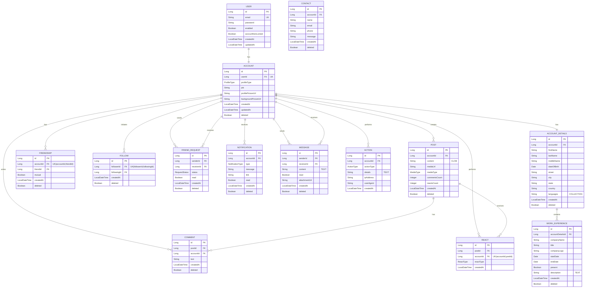
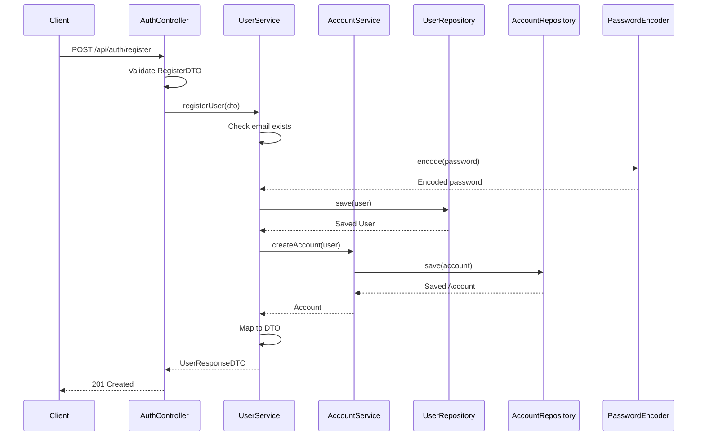
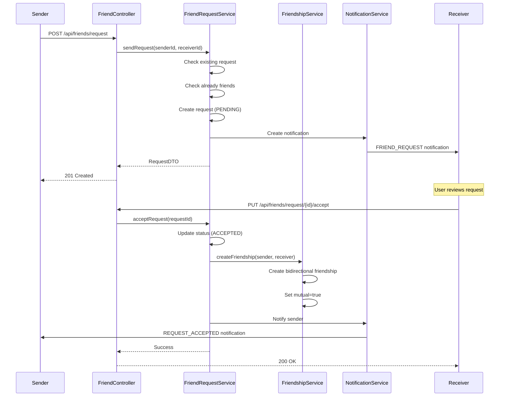
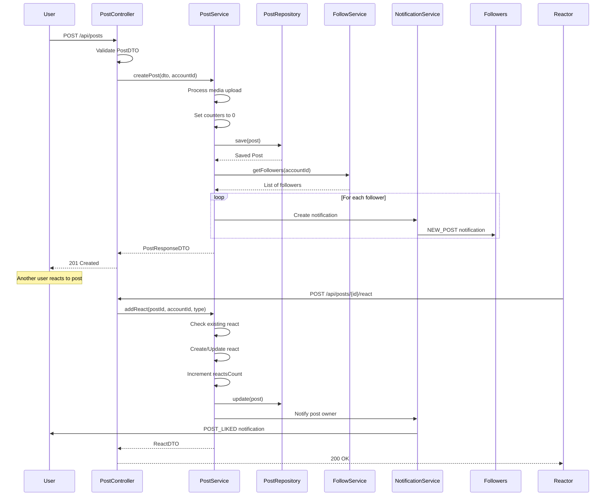
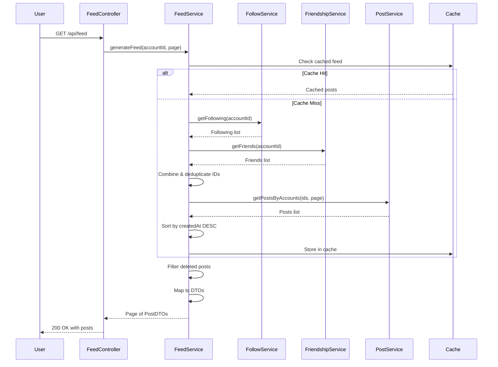
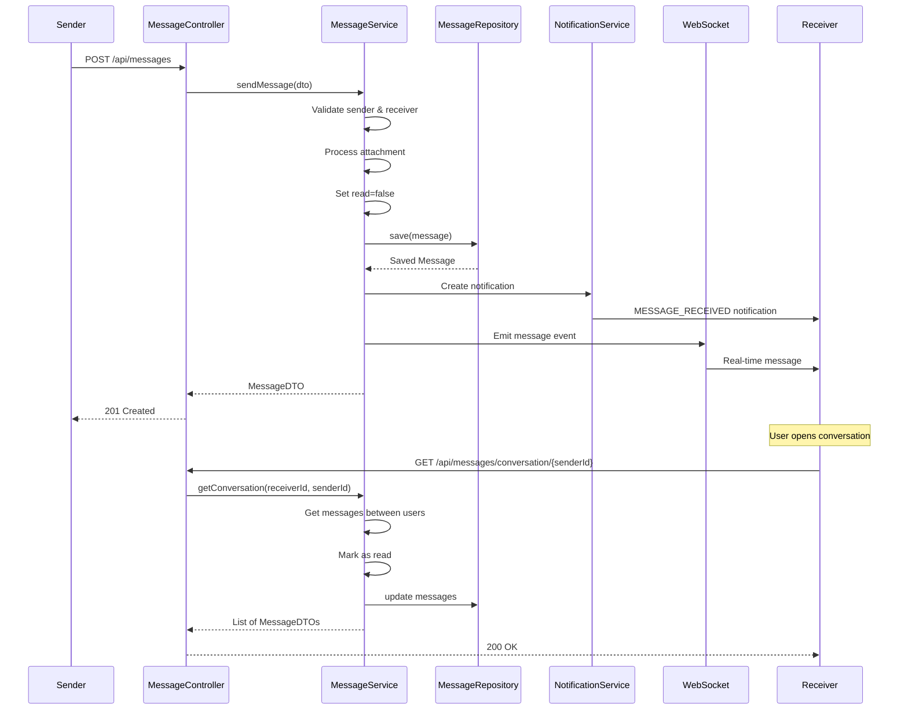
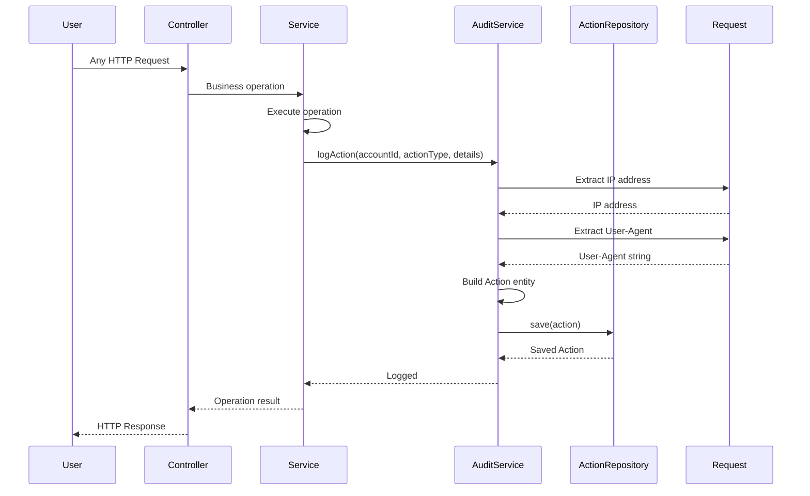
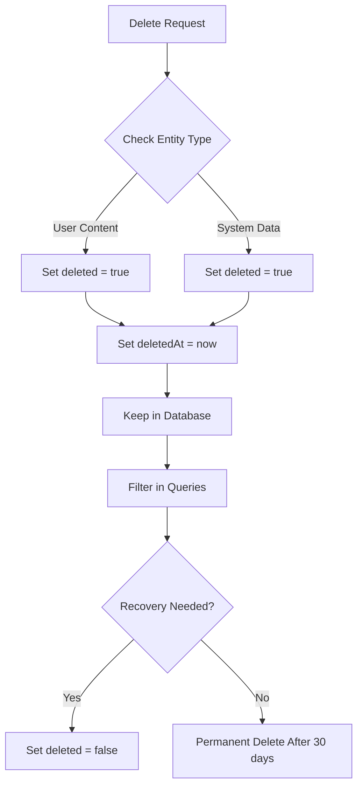
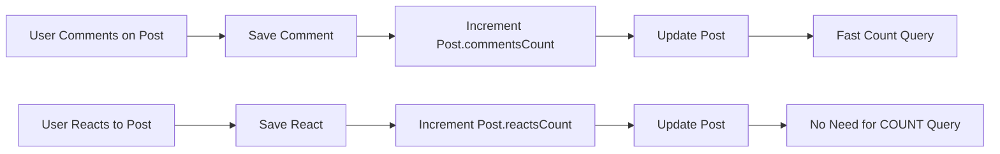

# 🗄️ Database Schema

## Entity Relationships



## 📊 Data Flow Diagrams

### User Registration & Authentication Flow



### Friend Request Workflow



### Post Creation & Interaction Flow



### Timeline Feed Generation



### Message Exchange Flow



### Action Logging & Audit Flow



## 🔍 Key Design Patterns

### Soft Delete Pattern


### Counter Denormalization Pattern


## 📈 Database Indexes Strategy

### Timeline Queries
```sql
-- Optimized for feed generation
CREATE INDEX idx_post_account_created ON posts(account_id, created_at DESC);

-- Optimized for follow relationships
CREATE INDEX idx_follow_follower_created ON follows(follower_id, created_at DESC);
CREATE INDEX idx_follow_following_created ON follows(following_id, created_at DESC);
```

### Social Graph Queries
```sql
-- Friendship lookups
CREATE INDEX idx_friendship_account_friend ON friendships(account_id, friend_id);
CREATE INDEX idx_friendship_friend_account ON friendships(friend_id, account_id);

-- Friend request status
CREATE INDEX idx_request_receiver_status ON friend_requests(receiver_id, status);
CREATE INDEX idx_request_sender_status ON friend_requests(sender_id, status);
```

### Notification Queries
```sql
-- Unread notifications
CREATE INDEX idx_notification_account_read ON notifications(account_id, read);
CREATE INDEX idx_notification_created ON notifications(created_at DESC);
```

### Message Queries
```sql
-- Conversation loading
CREATE INDEX idx_message_sender_receiver_created 
    ON messages(sender_id, receiver_id, created_at DESC);

-- Unread messages
CREATE INDEX idx_message_receiver_read ON messages(receiver_id, read);
```

## 🎯 Enumerations Reference

### RequestStatus
```
PENDING → ACCEPTED → Creates Friendship
   ↓
REJECTED (Terminal State)
```

### ReactType
```
LIKE (👍) | LOVE (❤️) | HAHA (😂)
WOW (😮) | SAD (😢) | ANGRY (😠)
```

### MediaType
```
IMAGE | VIDEO | AUDIO | DOCUMENT
```

### NotificationType
```
FRIEND_REQUEST | POST_LIKED | POST_COMMENTED
NEW_FOLLOWER | MENTION | MESSAGE_RECEIVED
```

### ActionType (30+ types)
```
Authentication: LOGIN, LOGOUT
Content: POST_CREATED, POST_UPDATED, POST_DELETED
Social: FRIEND_REQUEST_SENT, FRIEND_REQUEST_ACCEPTED
Profile: PROFILE_UPDATED, SETTINGS_CHANGED
Messaging: MESSAGE_SENT, MESSAGE_READ
```

## 📊 Database Statistics

| Metric | Count |
|--------|-------|
| **Total Entities** | 15 |
| **Total Relationships** | 20+ |
| **Total Indexes** | 25+ |
| **Unique Constraints** | 6 |
| **Enum Types** | 8 |
| **Soft Delete Enabled** | All Entities |

## 🚀 Performance Optimizations

- **Denormalized Counters**: `commentsCount`, `reactsCount` on posts
- **Composite Indexes**: Multi-column query optimization
- **Soft Deletes**: Data recovery without backup restoration
- **Bidirectional Relationships**: Optimized friend/follow queries
- **Read Flags**: Quick unread count calculations
- **Timestamp Indexes**: Efficient timeline generation